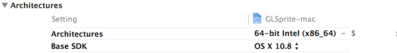
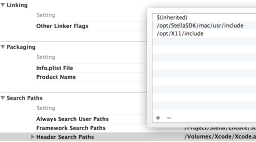
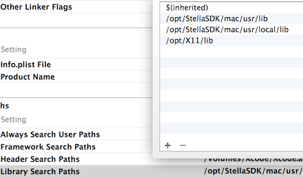

####Run StellaSDK with XCode 5

1. The Stella Android simulator need the X11 libraries. Download [**xquartz**](http://xquartz.macosforge.org/landing/) and  install it.

2. After installation, Reboot computer.

3. Open the Xcode 5 mac project, choose the Base SDK to macosx 10.8, 

And change the X11 path from $(SDKROOT)/usr/X11 to /opt/X11 (X11 default  installation directory) in the Header Search Paths and Library Search Paths build settings.

